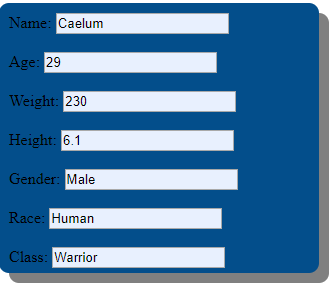
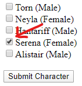
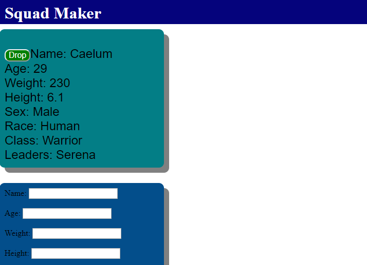
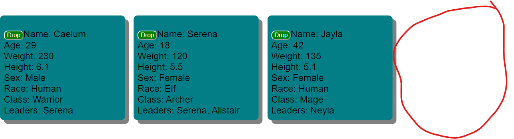

# Squad Maker

This application let's you build your very own DnD fantasy squad!! Follow along in this walkthrough to make your squad today!

## Get Started

On the main page you will see an empty screen aside from the new character form and a list of current squad leaders. You are the Battalion Commander and it is your job to select and or create the perfect characters for each leader's squad. To add a new character follow the next step.
 

## Creating a Character

In the empty for you will see a field for each attribute to fill out. There are no preset attributes so feel free to put down anything that you my dream of to put in there. This is your fantasy legion remember, so go wild and get creative!

One thing to note when filling out the "height" field is that it is accepted in the decimal format, i.e "6.1" is 6 feet 1 inch, "5.11" is 5 feet 11 inches etc..
 

To finish creating your character, to add it to a leaders squad by checking <em><strong>ONLY ONE</strong></em> leader's checkbox:
 

 
Click "Submit Character" and you should see the new character instantly pop up on your screen!

Voila! You have made and assigned your very first character. Whoop!!!

## Deleting a Character

To delete a character from a squad and the board navigate to the player card and locate the drop button:
 

 
Click "Drop" and you will see the character instantly disappear and the remaning characters will remain intact:
 

## Conclusion

Thank you for spending the time to take part in this application! I hope you had fun generating your own squads!! Feel free to comeback and explore more as this app will be updating in the future!!

## License

[MIT](https://choosealicense.com/licenses/mit/)
